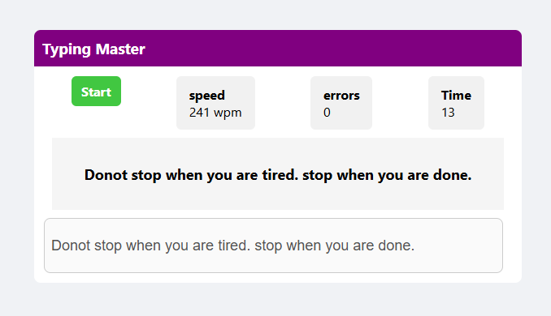

# Typing Master V1

Typing Master V1 is a simple and interactive typing speed test tool that helps users practice and improve their typing skills. It compares user input against a randomly generated quote and calculates typing metrics such as **Words Per Minute (WPM)**, **error count**, and **elapsed time**.



## 🚀 Features

- ⌨️ Random quote generator for typing practice
- 🕒 Real-time timer to track typing duration
- 📊 Calculates WPM (Words Per Minute)
- ❌ Error detection by comparing input with target text
- 🧼 Clean UI and user-friendly design

## 🔧 Technologies Used

- HTML5
- CSS3
- JavaScript

## 📦 How to Use

1. Clone the repository:
   ```bash
   git clone https://github.com/ammulu3102/typing_master.git
